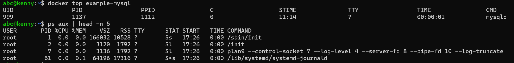
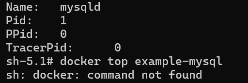
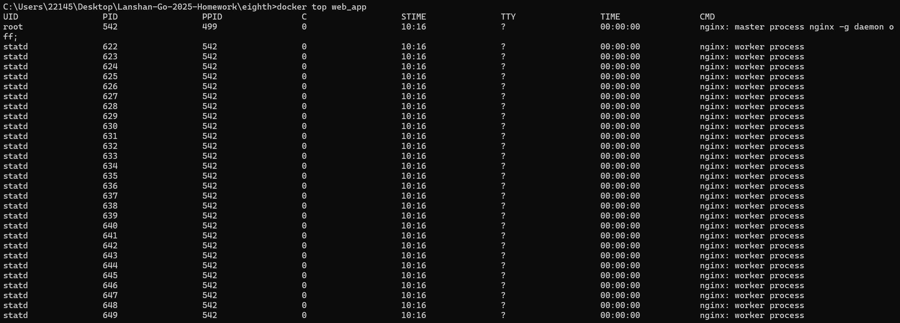
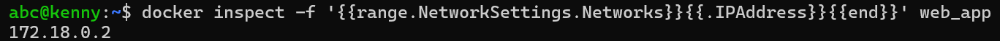
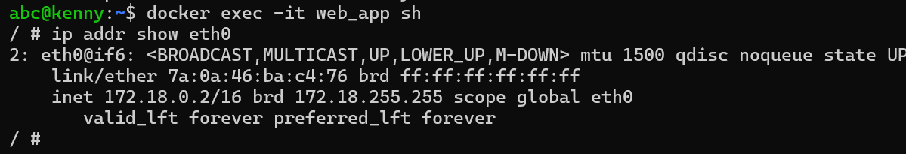

# 容器到底是不是虚拟机？请用“证据”说明

1. Mysql容器内看到的 PID=1 是mysqld 进程  
2. PID 1 控制整个容器生命周期，PID 1被杀死Docker 认为主进程结束了，容器就停止  
3. 宿主机是可以看到容器里的进程的，因为 Docker 容器本质上就是宿主机上的普通 Linux 进程，只是被隔离在 namespace 和 cgroups 中  

  
  

---

# 用 docker-compose 构建一个「最小可用系统」

详情见 `docker-compose.yml` 文件

---

# Docker 容器在 Linux 里留下了什么痕迹？

A. 容器进程本体，如图所示  
  
B. IP 地址，如图所示  
  
  

---

# Docker 是如何把一个普通进程，变成‘看起来像一台机器’的？

答：Docker 通过 Linux 内核的 `namespace` 和 `cgroups`，把一个普通进程隔离起来，使它拥有独立的 PID、网络、文件系统和资源配额，从而看就像一台独立的“虚拟机器”。
